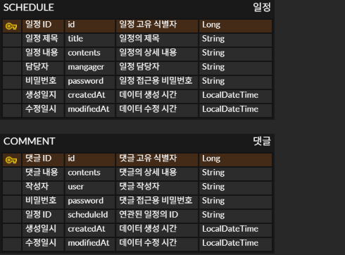

# 일정 관리 앱

## 1. API 명세

| Method | URL | 설명 |
| --- | --- | --- |
| `POST` | `/api/schedules` | 일정 등록 |
| `GET` | `/api/schedules` | 전체 일정 조회 |
| `GET` | `/api/schedules/{id}` | 선택 일정 조회 |
| `PUT` | `/api/schedules/{id}` | 선택 일정 변경 |
| `DELETE` | `/api/schedules/{id}` | 선택 일정 삭제 |

## 2. ERD

